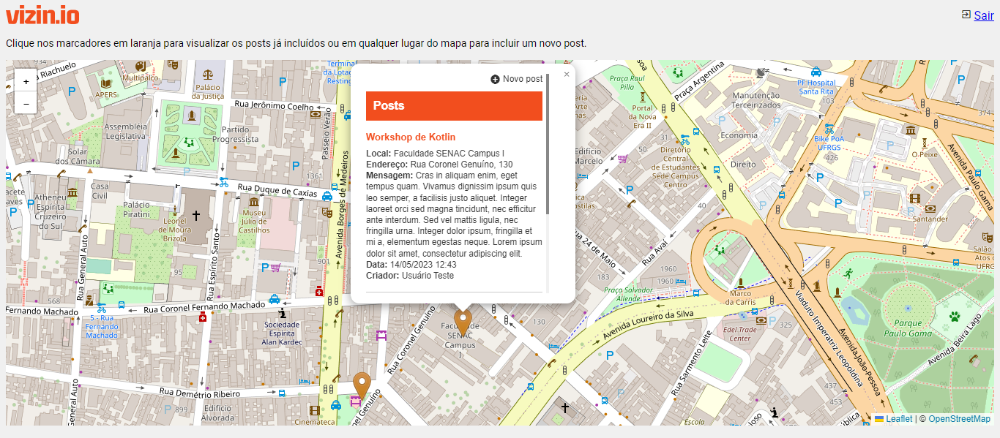

# vizin.io     


Esse projeto foi criado para a cadeira Projeto Integrador do 4º semestre do tecnólogo de Análise e Desenvolvimento de Sistemas da Faculdade Senac.

O projeto Vizin.IO é uma aplicação web que utiliza a linguagem de programação PHP e o banco de dados MariaDB. O objetivo da aplicação é criar uma rede social de bairro, onde os vizinhos podem se conhecer, fomentar eventos locais e melhorar o bairro onde moram. Através do Vizin.IO, os usuários podem criar perfis, adicionar amigos, criar e participar de eventos, bem como trocar mensagens e compartilhar informações relevantes para a comunidade.

Observação: por ser um projeto de faculdade, as tecnologias utilizadas se limitam às cadeiras apresentadas pelo curso. A entrega do semestre se refere a uma funcionalidade do sistema, por isso, o mesmo não está completo.

## Autores

| [<br><sub>Jéssica Rodrigues</sub>](https://github.com/jessicasrodrigues)  | [<br><sub>Gisele Bittencourt</sub>](https://github.com/GiseleAquistapace)  |  [<br><sub>Felipe Craveiro</sub>](https://github.com/flpcnc) |
|---|---|---|
|  [<br><sub>Kauan Yamada</sub>](https://github.com/KauanYamada) | [<br><sub>Gleyco da Silva</sub>](https://github.com/mathmsd)  | [<br><sub>Samuel Gomes</sub>](https://github.com/SamuelCrepaldi)  |


## Instalação

#### Versões utilizadas no desenvolvimento:
* PHP 8.0.28
* Apache 2.4.56
* MariaDB 10.4.28

#### Setup do banco de dados: execute os arquivos dentro da pasta `bd` na ordem:
* `meu_banco.sql`
* `post.sql`

Atentar dados de conexão em `conexao.php`.

#### Outras instruções:
* Esse projeto usa mod_rewrite no htacess para o index.php - Certifique-se que o Apache está com AllowOverride All
* Habilitar o PDO Mysql no `php.ini`
* Configure no hosts do seu SO: `127.0.0.1 vizin.io`
* Se você está usando o xampp, configure no htdocs do seu Apache o DocumentRoot para a pasta do projeto vizin.io. Exemplo:
```
DocumentRoot "C:/xampp/htdocs/Vizin.IO"
```
* Também no htdocs, atualize o Directory:
```xml
<Directory "C:/xampp/htdocs/Vizin.IO">
```

Não se esqueça que após mexer nas configurações do servidor, você terá que reiniciar o servidor.

## Funcionalidades:
#### Visualizar locais que possuem postagem


#### Visualizar postagens


#### Realizar postagem

=======
# Vizin.IO
Projeto de app para Atividade da Graduação do SENAC
